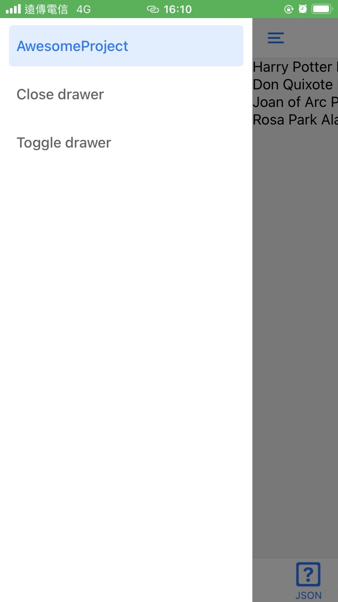
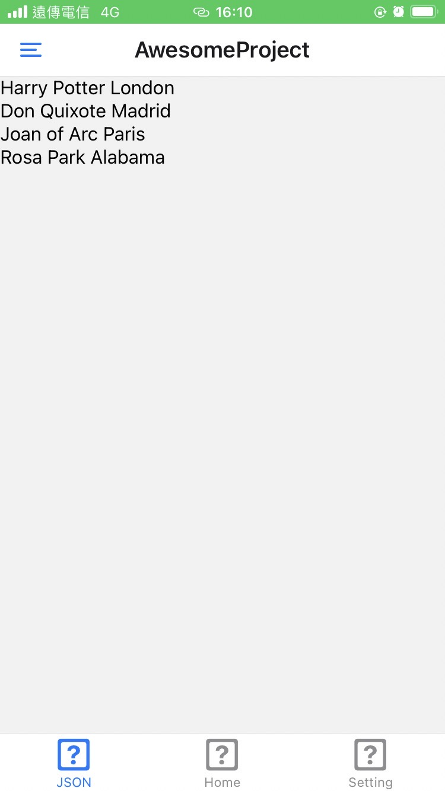

# React Native Awesome Project




<br/>

## 本地端測試

```js
git clone https://github.com/mhsiungw/ReactNative.git
cd ReactNative
npm i
npm run start
```

<br/>

## 程式架構


主要與程式相關的檔案是 `App.js` JS 檔，與三個藍色資料夾裡的 JS 檔。

1. `screens` 資料夾放置與**畫面**相關的程式碼
2. `navigators` 資料夾主要與**畫面的 navigation** 有關，
3. `style` 資料夾裡是 `screens` 的**樣式**。

<br/>

## 各項目進行的時間

1. 下方 APP tab 切換頁面 --- **30 mins**
2. app 選單點擊打開、收起 --- **1 hour 30 mins**
3. 串接一組列表資料 api，並可瀏覽 --- **5 mins**

<br/>

## 測試題目

-   [x] 下方 APP tab 切換頁面
-   [x] app 選單點擊打開、收起
-   [x] 串接一組列表資料 api，並可瀏覽
-   [x] 程式架構盡可能做到你最滿意的方式並於 readme 說明
-   [x] 於 readme 寫下各項目進行的時間
-   [x] 說明 IOS、Android 的上架流程與注意事項，並以 md 檔案描述
-   [x] 上傳於 Github 提供
